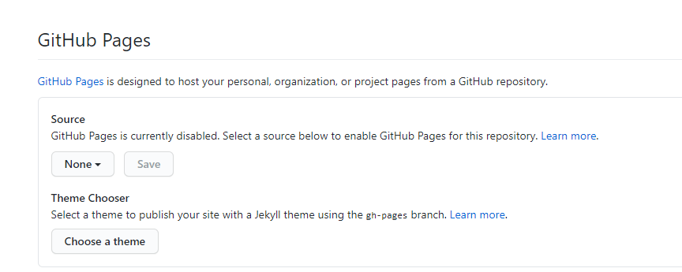
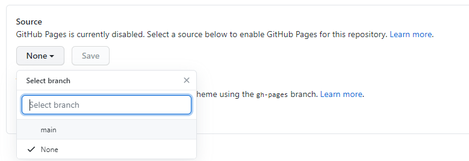

# Размещение на Github Pages

После того, как вы разместили на Github код сайта, можно сделать сайт доступным на Github Pages.

Для этого зайдите в настройки репозитория и найдите там следующий пункт:

Затем выберите источник:

Дело сделано, теперь вы можете увидеть ваш сайт. Вернитесь на главную страницу репозитория, где вы можете обнаружить следующую ссылку:

***

[Назад](./09-cancel.md) ~~
[Содержание](./readme.md)